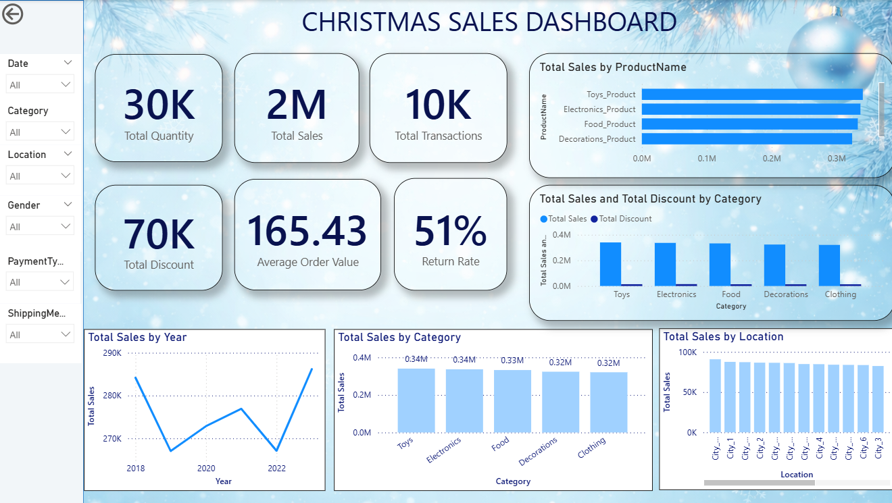
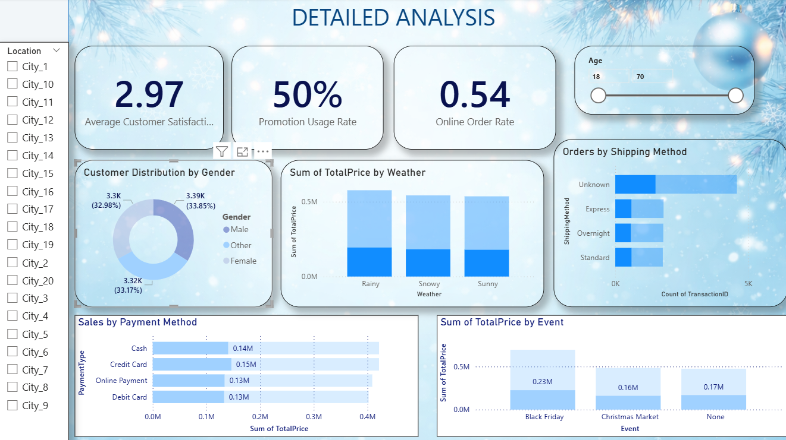

#  Christmas Sales Analytics Dashboard – Power BI

##  Project Overview

This project presents an interactive **Power BI dashboard** that analyzes Christmas retail sales data.
The dashboard provides insights into **sales trends, product categories, customer demographics, promotions, and payment behavior**.

The project demonstrates skills in **data cleaning, transformation, and business intelligence visualization**.

---

#  Dashboard Preview

## Main Sales Dashboard

## Detailed Analysis Dashboard

---

# Dataset Information

The dataset contains **transaction-level Christmas retail sales data**.
---

### Key Features

* Date and Time of transaction
* Customer demographics
* Product categories
* Promotions and discounts
* Payment methods
* Weather and events
* Customer satisfaction
* Product returns
---

##  Dataset Source

The dataset used in this project is sourced from Kaggle.

Dataset Name: **Christmas Sales and Trends**

Dataset Link:
https://www.kaggle.com/datasets/ibikunlegabriel/christmas-sales-and-trends

Author: **Ibikunle Gabriel**

License: **CC0 – Public Domain**

This dataset was originally provided as part of the **Onyx Data Challenge (December 2023)** and contains transaction-level retail sales data related to Christmas shopping trends. 

---

#  Data Cleaning

Data preprocessing was performed using **Power Query Editor**.

Cleaning steps included:

* Promoted headers
* Corrected data types
* Trimmed and cleaned text values
* Replaced missing values
* Removed unnecessary columns
* Created custom calculated columns

After cleaning, the dataset was ready for analysis.

---

#  Dashboard KPIs

The dashboard includes key business metrics:

* Total Sales
* Total Quantity Sold
* Total Transactions
* Total Discount
* Average Order Value
* Return Rate
* Promotion Usage Rate
* Online Order Rate
* Customer Satisfaction

---

#  Visual Insights

The dashboard provides insights such as:

* Sales by Product
* Sales by Category
* Sales by Location
* Customer Distribution by Gender
* Orders by Shipping Method
* Sales by Payment Method
* Sales by Weather Conditions
* Sales by Events (Black Friday, Christmas Market)

---

#  Tools Used

* Power BI
* Power Query
* DAX
* GitHub

---

# 👨‍💻 Author

**Alen Aby**
MSc Big Data Analytics
St. Joseph's University
